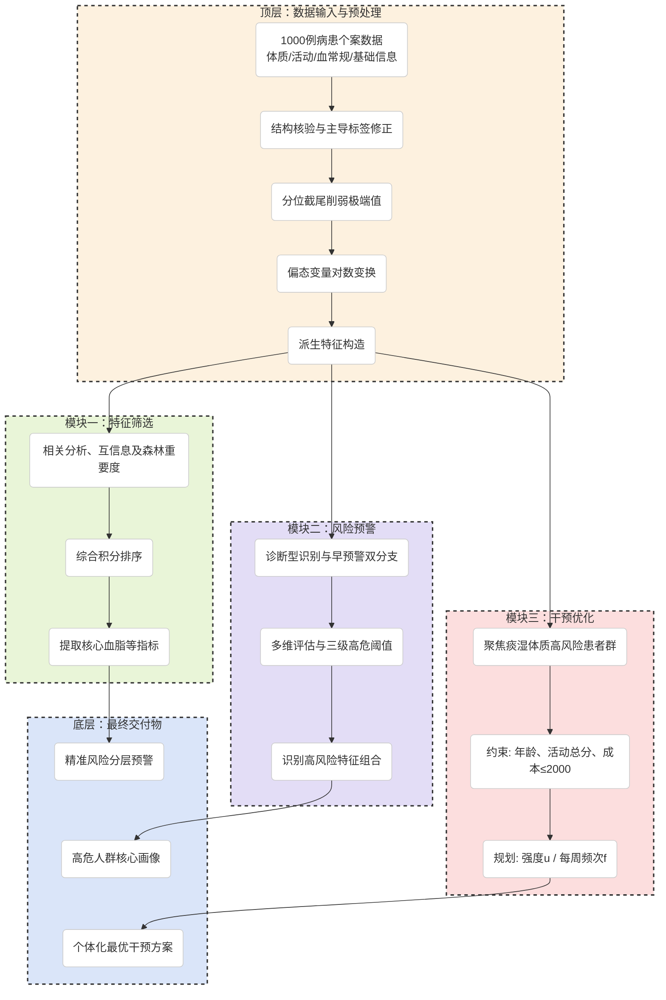

# 总体框架与数据预处理流程图

```mermaid
flowchart TD
    %% 节点默认样式，圆角白色方块
    classDef nodeStyle fill:#fff,stroke:#ccc,stroke-width:1px,color:#333,rx:5px,ry:5px;
    
    %% 第一区块（上方）：横向拓展
    subgraph TOP [ 顶层：数据输入与预处理 ]
        direction LR
        A1(1000例病患个案数据<br>体质/活动/血常规/基础信息)
        A2(结构核验与主导标签修正)
        A3(分位截尾削弱极端值)
        A4(偏态变量对数变换)
        A5(派生特征构造)
        
        A1 --> A2 --> A3 --> A4 --> A5
    end
    style TOP fill:#fdf1df,stroke:#333,stroke-width:2px,stroke-dasharray: 5 5
    
    %% 中间三大区块（并排位于中间）
    subgraph MID1 [ 模块一：特征筛选 ]
        direction TB
        B1(相关分析、互信息及森林重要度)
        B2(综合积分排序)
        B3(提取核心血脂等指标)
        B1 --> B2 --> B3
    end
    style MID1 fill:#e9f5d8,stroke:#333,stroke-width:2px,stroke-dasharray: 5 5
    
    subgraph MID2 [ 模块二：风险预警 ]
        direction TB
        C1(诊断型识别与早预警双分支)
        C2(多维评估与三级高危阈值)
        C3(识别高风险特征组合)
        C1 --> C2 --> C3
    end
    style MID2 fill:#e3ddf6,stroke:#333,stroke-width:2px,stroke-dasharray: 5 5
    
    subgraph MID3 [ 模块三：干预优化 ]
        direction TB
        D1(聚焦痰湿体质高风险患者群)
        D2(约束: 年龄、活动总分、成本≤2000)
        D3(规划: 强度u / 每周频次f)
        D1 --> D2 --> D3
    end
    style MID3 fill:#fcdede,stroke:#333,stroke-width:2px,stroke-dasharray: 5 5
    
    %% 第五区块（下方）：横向拓展
    subgraph BOT [ 底层：最终交付物 ]
        direction LR
        E1(精准风险分层预警)
        E2(高危人群核心画像)
        E3(个体化最优干预方案)
        %% 使用无连接线占位符保持分离
        E1 ~~~ E2 ~~~ E3
    end
    style BOT fill:#dae5f9,stroke:#333,stroke-width:2px,stroke-dasharray: 5 5
    
    %% 跨层纵向连线
    A5 --> B1
    A5 --> C1
    A5 --> D1
    
    B3 --> E1
    C3 --> E2
    D3 --> E3
    
    %% 应用节点样式
    class A1,A2,A3,A4,A5,B1,B2,B3,C1,C2,C3,D1,D2,D3,E1,E2,E3 nodeStyle;
```
