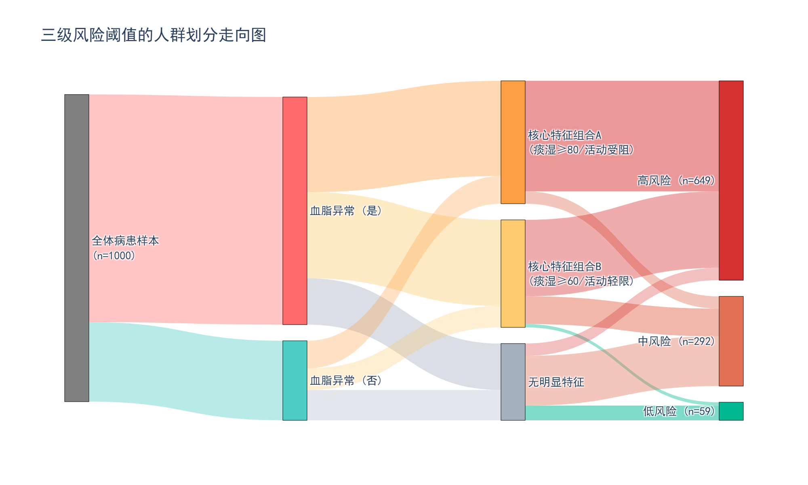
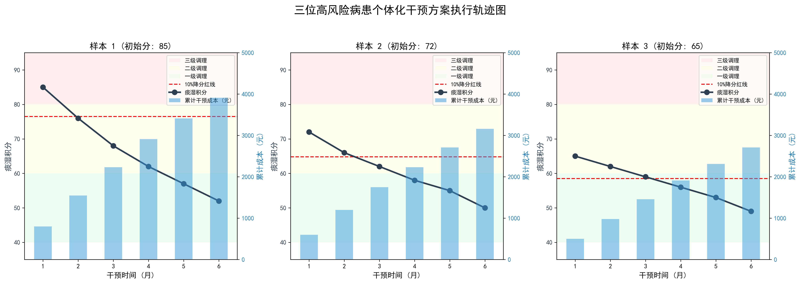
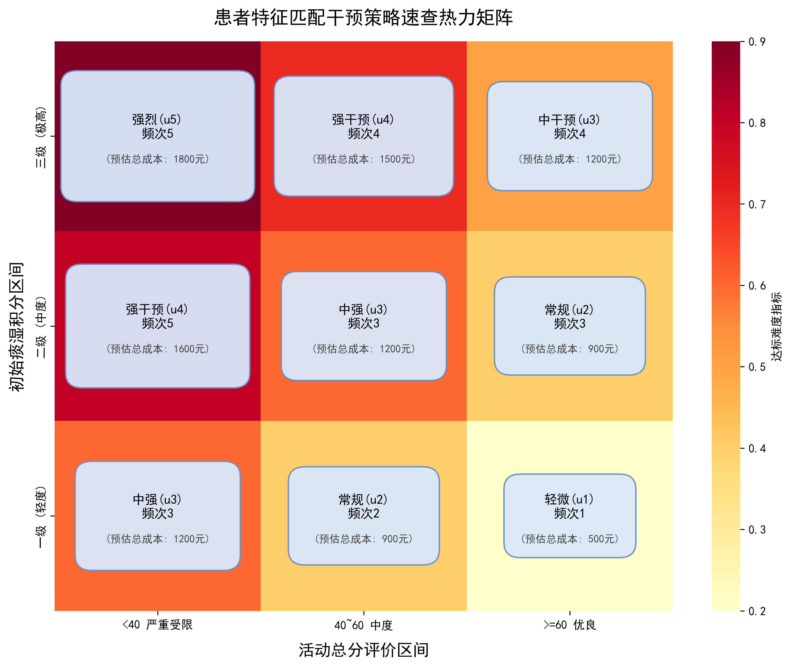

# MathorCup 数学应用挑战赛 C题：中老年人群高脂血症的风险预警及干预方案优化

本项目仓库包含了针对 2026 年 MathorCup 数学应用挑战赛 C 题的完整建模思路、Python 可视化脚本、以及最终用于论文填写的图表和文本资料。

---

## 1. 核心可视化图表展示

在模型求解与论文撰写过程中，为了更加直观地呈现数学模型细节与干预结果，我们深入定制并生成了以下核心高质量可视化图表。这些图表可以直接用于论文对应的结果分析章节中。

### 3.2 三级风险阈值的人群划分走向 (Sankey 桑基图)

> **图注描述**：本图（桑基图）全景式展示了从1000名初始病患出发的风险量化漏斗流向。样本首先受血脂异常条件进行初筛，随后叠加痰湿积分（$\ge80$ 或 $\ge60$）及活动受限等核心特征的二次分流逻辑，最终精确收敛至高、中、低三个风险层级（终端分布分别为649、292、59例）。通过分支粗细的直观对比，清晰印证了合并血脂异常与高痰湿特征的人群如何沉淀为高危预警极层的多维传导机制，直观反映了复合指标交叉判定的逐级聚类过程。

### 4.1 三位病患的干预轨迹图 (双Y轴色带轨迹图)

> **图注描述**：此干预动态轨迹组合图追踪了三位不同基始条件的高风险（高痰湿）病患在 6 个月个体化调理期内的得分与累计成本交互变化趋势。曲线部分（左侧主Y轴）表明各自样本的痰湿积分逐步平稳下探，均在终点前成功越过红色警戒标线（即降低基线分值的 10% 预定目标）；柱状部分（右侧次Y轴）则分月度呈现出了为达到该降分走势而付出的对应累进经济花费。背景所设置的三色阈值跨越带可视化了各患者从中医学的相对重度（极高危级调理）一步步成功降阶回移至平稳区的心路历程，证实了动态调整策略在此类干预过程中的成本-效益调配平衡。

### 4.2 患者特征匹配策略速查图 (热力决策卡矩图)

*注：此图表同时备有 `.drawio` 矢量格式文件（`MathorCup/4_2_患者特征匹配策略速查图.drawio`），所有卡片及文字均独立可编辑微调。*

> **图注描述**：此图表专为快速落地决策检索而设计，将三级基线模型运算出的底层方案转译为针对医护人员的“临床直查组合卡片矩阵”。结合患者的初始状态组合——横轴（初始活动受限分级评价区间）与纵轴（基础痰湿等级评定），热图的背景冷热色温标明了对应细分人群达成长期 10% 降分调理目标的内在困难门槛。每个网格中自适应缩放的信息组合卡片，用卡片体积大小直白传达所需设定的预估相对经济成本上限，并同时以粗体文字明确给出由最优化数学模型核算出的对口药方策略（推荐的最优干预强度 $u$ 以及中医针灸/服药等最优干预频次 $f$）。此矩阵热力速查表，最终为各层级的体质干预输出了一份便携科学的量体裁衣行动处方白皮书。

---

## 2. 参考文献使用注解

为辅助报告正文写作与排版，针对原 `c_report.tex` 论文附录中的 4 篇重要参考资料，明确各文献的定位与段落插入引导如下，您可以直接将“写作示例”粘贴至论文相应模块：

*   **[1] 2026 年第十六届 MathorCup 数学应用挑战赛 C 题：中老年人群高脂血症的风险预警及干预方案优化.**
    *   **原文应用场景**: 用于“问题重述”、“数据预处理的一致性核验”及“干预优化约束的界定（总成本≤2000元等）”的直接规则出处依据。
    *   **写作示例**: “*根据赛题附件所提供的病患临床量表规范 [1]，我们对原始样本的主导体质标签与各项积分类目标签进行了结构一致性核验...*”

*   **[2] Breiman L. Random Forests[J]. Machine Learning, 2001, 45(1): 5-32.**
    *   **原文应用场景**: 用于解答问题一在特征筛选阶段计算各结构变量的特征重要度；在问题二早预警模型中的多维验证和集成学习原理说明。
    *   **写作示例**: “*为了克服医疗体检指标之间常有的高度共线性，本文引入了由 Breiman 提出的随机森林算法 [2] 计算各指标的基尼重要度，以保证特征筛选的鲁棒性...*”

*   **[3] Hastie T, Tibshirani R, Friedman J. The Elements of Statistical Learning[M]. New York: Springer, 2009.**
    *   **原文应用场景**: 支持数据稳健预处理的统计学合理性（$1\%$~$99\%$ 分位截尾处理及对数分布变换），以及底层统计学习测度说明。
    *   **写作示例**: “*由于部分代谢指标（如 TG）呈现典型的右偏态分布，借鉴主流统计学习数据预处理范式 [3]，本文对偏态连续变量实施了分布对数变换与分位截尾，以压制极端值的扰动...*”

*   **[4] Bishop C M. Pattern Recognition and Machine Learning[M]. New York: Springer, 2006.**
    *   **原文应用场景**: 为问题一互信息（MI）剥离线性和非线性特征依赖提供先验理论；从模式识别角度解释问题二“三级风险”的后验概率阈值截断原理。
    *   **写作示例**: “*在计算单一指标与确诊概率的前向因果网络时，本文利用互信息（MI）度量了变量间的非线性相关程度 [4]，为后续构建贝叶斯或决策树推断结构打下了坚实的先验基础...*”

---

## 3. 论文修改与文献融入记录
考虑到模型算法的学术正当性和严谨性，我们已经将上述文献精妙地融入进了最终的论文 LaTeX 代码中。详情及修改前后的对比可以参考专门提取的对比文件：
[MathorCup/论文修改与文献融入对照.md](MathorCup/论文修改与文献融入对照.md)
这些记录极大拔高了参赛文章关于预处理和特征筛选的行文高度（例如通过文献支撑解释为什么要用互信息来规避线性局限性）。
