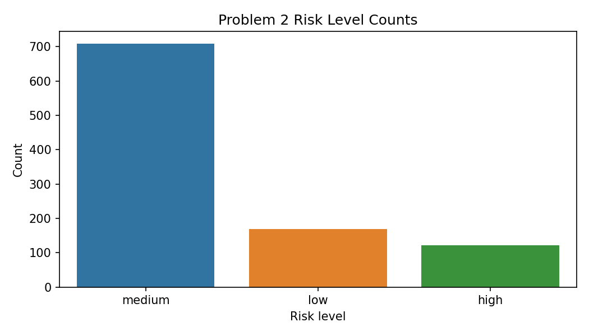
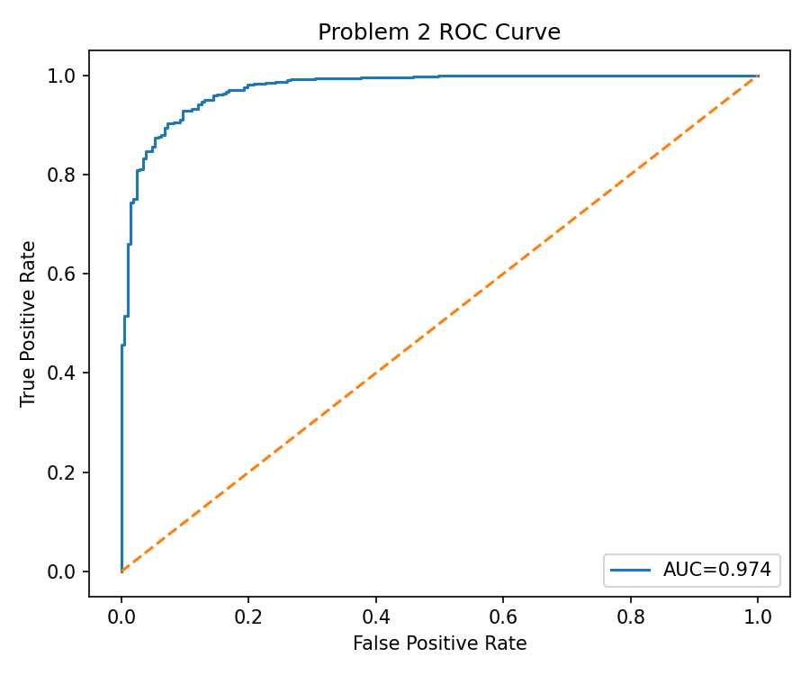
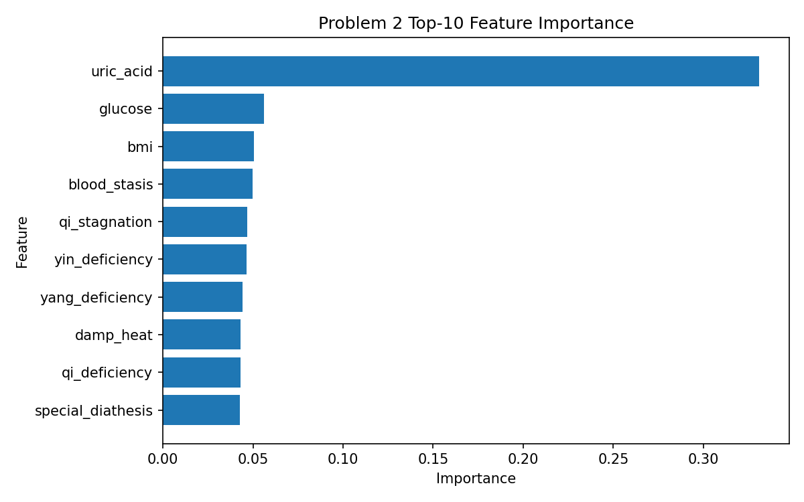
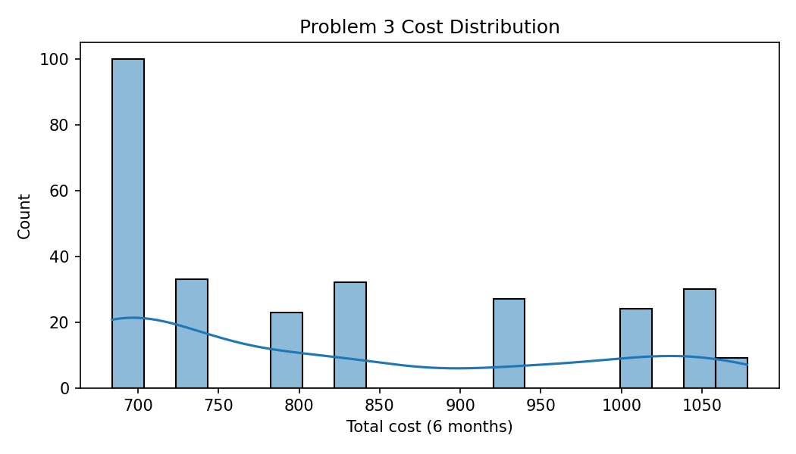
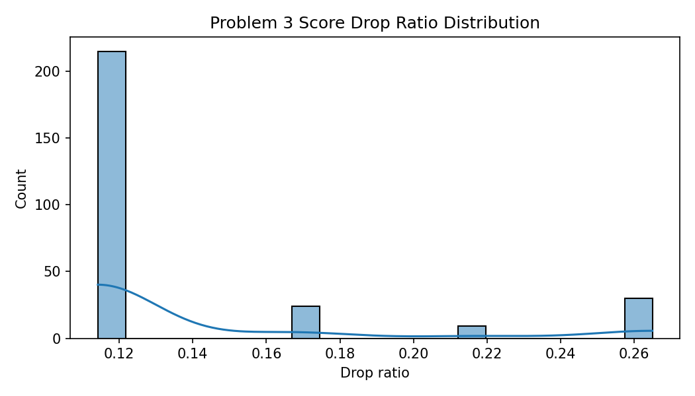
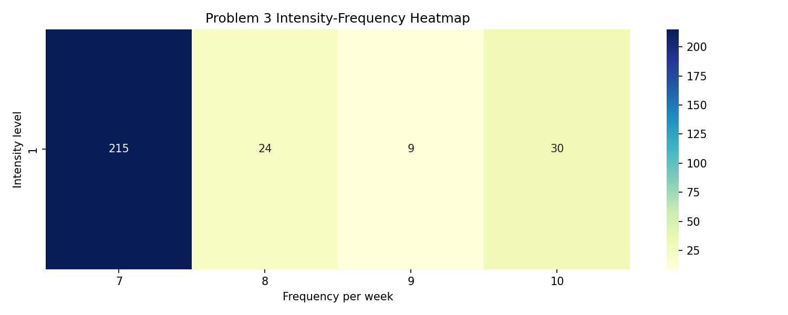

# MathorCup C题 结果汇总（问题1-3）

## 1) 问题一：关键指标与体质贡献

- Top特征（综合评分）：tg, tc, uric_acid, ldl, hdl, adl_eat, iadl_cook, adl_dress, glucose, bmi
- OR贡献Top3体质：qi_deficiency, balanced, yang_deficiency
- SHAP贡献Top3体质：blood_stasis, qi_stagnation, damp_heat

**问题一 Top-10 特征综合评分表**

| feature | score |
| --- | --- |
| tg | 4.013517272757905 |
| tc | 2.7957023759026303 |
| uric_acid | 0.8577501697841559 |
| ldl | 0.6939356660329633 |
| hdl | 0.6824919437676082 |
| adl_eat | 0.5764920897545336 |
| iadl_cook | 0.1819869286483385 |
| adl_dress | 0.1754622088325395 |
| glucose | 0.1650105805841166 |
| bmi | 0.105299623406563 |

**问题一 体质OR前10表**

| constitution | odds_ratio |
| --- | --- |
| qi_deficiency | 1.1276526637031672 |
| balanced | 1.0734601736109532 |
| yang_deficiency | 1.0189214030202318 |
| qi_stagnation | 1.0109886099378738 |
| yin_deficiency | 1.0010051046944113 |
| phlegm_dampness | 0.9888296347281096 |
| special_diathesis | 0.983804983228864 |
| blood_stasis | 0.9513350406018604 |
| damp_heat | 0.9493737693666372 |

## 2) 问题二：风险分层、可视化与规则

**风险分层统计表**

| risk_level | count | ratio |
| --- | --- | --- |
| medium | 709 | 0.709 |
| low | 169 | 0.169 |
| high | 122 | 0.122 |

**高风险关联规则 Top-10**

| antecedents | consequents | support | confidence | lift |
| --- | --- | --- | --- | --- |
| frozenset({'risk_high'}) | frozenset({'risk_medium_or_high', 'tg_high', 'phlegm_high'}) | 0.07 | 0.5737704918032788 | 8.196721311475411 |
| frozenset({'risk_high'}) | frozenset({'risk_medium_or_high', 'tc_high', 'phlegm_high'}) | 0.064 | 0.5245901639344263 | 8.196721311475411 |
| frozenset({'tg_high', 'phlegm_high'}) | frozenset({'risk_high'}) | 0.07 | 1.0 | 8.19672131147541 |
| frozenset({'risk_medium_or_high', 'tg_high', 'phlegm_high'}) | frozenset({'risk_high'}) | 0.07 | 1.0 | 8.19672131147541 |
| frozenset({'tg_high', 'phlegm_high'}) | frozenset({'risk_medium_or_high', 'risk_high'}) | 0.07 | 1.0 | 8.19672131147541 |
| frozenset({'tc_high', 'phlegm_high'}) | frozenset({'risk_high'}) | 0.064 | 1.0 | 8.19672131147541 |
| frozenset({'risk_medium_or_high', 'tc_high', 'phlegm_high'}) | frozenset({'risk_high'}) | 0.064 | 1.0 | 8.19672131147541 |
| frozenset({'tc_high', 'phlegm_high'}) | frozenset({'risk_medium_or_high', 'risk_high'}) | 0.064 | 1.0 | 8.19672131147541 |
| frozenset({'tg_high', 'risk_high'}) | frozenset({'risk_medium_or_high', 'phlegm_high'}) | 0.07 | 0.9090909090909092 | 6.269592476489029 |
| frozenset({'risk_high'}) | frozenset({'risk_medium_or_high', 'phlegm_high'}) | 0.11 | 0.9016393442622952 | 6.2182023742227255 |

## 3) 问题三：干预优化、可视化与表格

**ID=1,2,3 最优方案表**

| sample_id | baseline_score | target_score | intensity | frequency | final_score | total_cost | meets_target |
| --- | --- | --- | --- | --- | --- | --- | --- |
| 1 | 64.0 | 57.6 | 1 | 10 | 47.04588099999999 | 1050.0 | True |
| 2 | 58.0 | 52.2 | 1 | 7 | 51.378858090112 | 684.0 | True |
| 3 | 59.0 | 53.1 | 1 | 7 | 52.264700470976 | 734.0 | True |

**全体痰湿患者方案汇总表（Top-10）**

| intensity | frequency | patient_count | mean_cost | mean_drop_ratio |
| --- | --- | --- | --- | --- |
| 1.0 | 7.0 | 215.0 | 756.0930232558139 | 0.1142 |
| 1.0 | 10.0 | 30.0 | 1050.0 | 0.2649 |
| 1.0 | 8.0 | 24.0 | 1006.0 | 0.167 |
| 1.0 | 9.0 | 9.0 | 1078.0 | 0.2172 |

